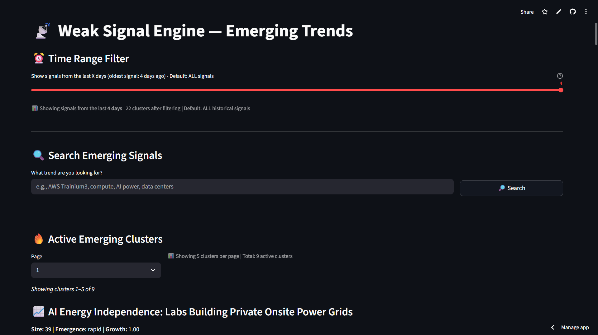
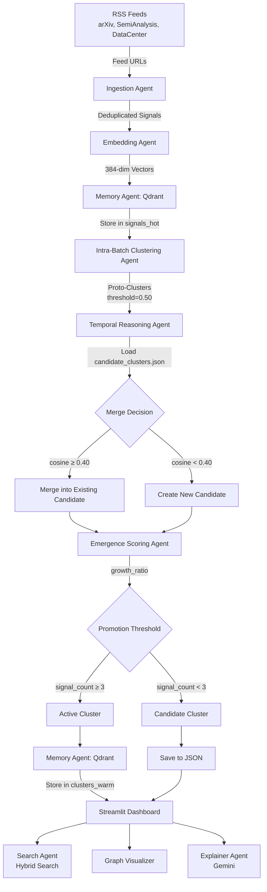
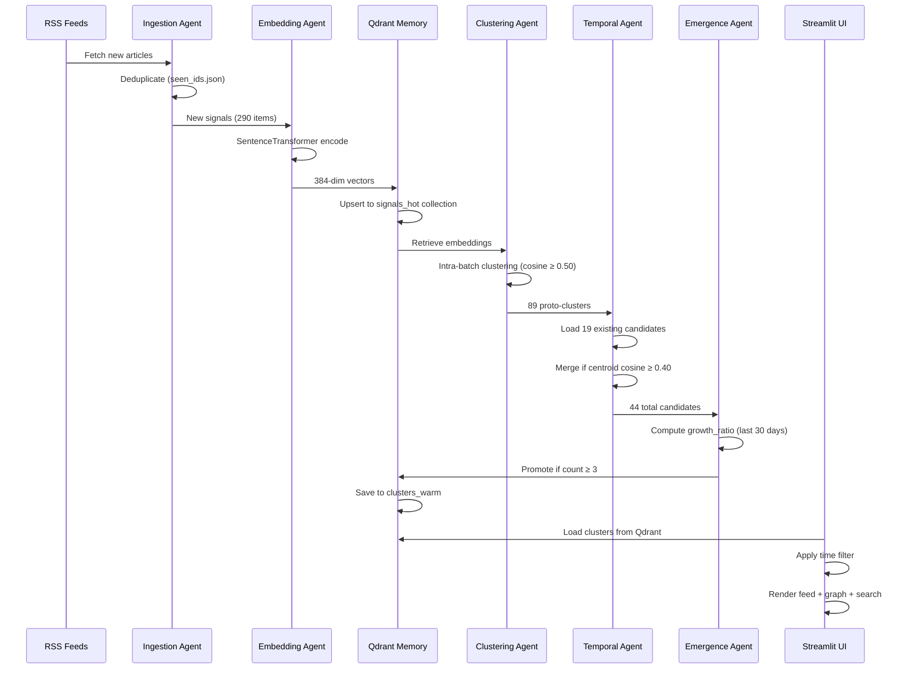
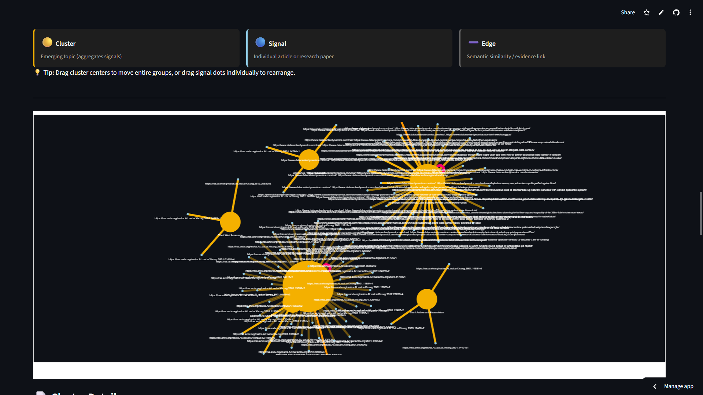
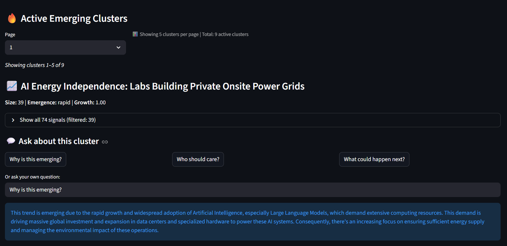
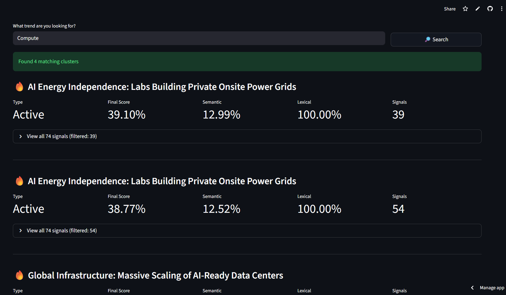

# SignalWeave  
**A Temporal Vector Memory System for Weak Signal Detection**

---

**Track:** Multi-Agent Systems (MAS)  
**Powered by:** Qdrant Vector Database  
**Event:** Convolve 4.0  
**Developer:** T Mohamed Yaser (Solo)  
**Date:** January 22, 2026  

**Tagline:** *Accumulating Evidence Over Time to Detect What Others Miss*

---

## Abstract

Emerging trends begin as **weak signals**—scattered, low-volume mentions that traditional systems dismiss as noise. SignalWeave solves the weak signal detection problem through **temporal accumulation in vector memory**: instead of snapshot-based analysis, it continuously ingests RSS feeds, embeds signals into 384-dimensional vectors, stores them in Qdrant Cloud, and evolves clusters across time using a two-stage merging strategy.

The system implements a **Multi-Agent System (MAS)** where specialized agents collaborate: an Ingestion Agent fetches and deduplicates RSS content, an Embedding Agent generates sentence vectors, a Memory Agent persists data in Qdrant, a Clustering Agent groups similar signals within batches, a Temporal Reasoning Agent merges new clusters into historical candidates, an Emergence Scoring Agent classifies growth velocity, a Search Agent combines semantic and lexical matching, and an Explainer Agent generates human-readable summaries using Gemini.

**Qdrant Cloud is the system's long-term memory substrate**—storing 1000+ signals and 25+ clusters with sub-second similarity search. A two-tier candidate-to-active promotion mechanism prevents over-clustering: proto-clusters remain "candidates" until they accumulate ≥3 signals over time, filtering noise while preserving genuine trends. Hybrid search (70% semantic + 30% lexical) handles both conceptual queries ("AI power consumption") and technical terms ("AWS Trainium3"). An interactive force-directed graph visualizes signal-cluster relationships, while time-based filtering reveals temporal evolution.

SignalWeave demonstrates that **persistent vector memory + temporal reasoning + multi-agent collaboration** enables early detection of trends invisible to static systems.


*Figure 1: SignalWeave Dashboard - Active clusters feed with temporal filtering and hybrid search*

---

## Problem Statement

### Why Weak Signals Are Invisible

**Weak signals** are early indicators of emerging trends—scattered blog posts, research preprints, niche industry announcements—that lack critical mass. Traditional information systems fail because:

1. **No Temporal Memory**: News aggregators show today's headlines. Search engines index static documents. Neither accumulates evidence over time.
2. **Snapshot Bias**: A single mention of "Trainium3 chip" is noise. Ten mentions over three weeks is a trend. But dashboards can't tell the difference.
3. **Clustering Brittleness**: Aggressive clustering creates false positives (every random keyword becomes a cluster). Conservative clustering misses real patterns (related signals never merge).
4. **Semantic-Only Search Fails**: Embedding-based search finds "chip architecture" when you query "GPU", but misses exact technical terms like "Trainium3" because they weren't in training data.

### What's Missing

- **Vector memory that persists across ingestion runs**
- **Clusters that evolve rather than freeze**
- **Temporal scoring that separates noise from signal**
- **Hybrid search that handles both concepts and keywords**

SignalWeave addresses all four using Qdrant as persistent memory and a multi-agent architecture for temporal reasoning.

---

## System Architecture (Code-Based)

### End-to-End Pipeline



### Data Flow Diagram



---

## Multi-Agent System Design (Implementation-Based)

### Agent Architecture

| Agent | Implementation | Input | Output | Key Logic |
|-------|---------------|-------|--------|-----------|
| **Ingestion Agent** | `rss_ingestor.py` | RSS feed URLs | `Signal` objects | Uses `feedparser`, deduplicates via `seen_ids.json`, extracts title+summary |
| **Embedding Agent** | `embedding_model.py` | Signal text | 384-dim vector | `SentenceTransformer('all-MiniLM-L6-v2')` |
| **Memory Agent** | `qdrant_client.py`, `cluster_memory.py` | Signals, Clusters | Persistent storage | Qdrant Cloud (`signals_hot`, `clusters_warm`), auto-increment IDs |
| **Clustering Agent** | `intra_batch_cluster.py` | Signals + embeddings | Proto-clusters | Greedy clustering: if cosine ≥ 0.50, merge into nearest cluster, else create new |
| **Temporal Reasoning** | `cluster_evolution.py` | Proto-clusters + candidates | Evolved candidates | Compute centroids, merge if cosine ≥ 0.40, deduplicate signals by ID |
| **Emergence Scoring** | `emergence.py` | Candidate clusters | Growth metrics | `growth_ratio = recent_count (30 days) / total_count`, classify rapid/stable/dormant |
| **Search Agent** | `search.py` | Query + clusters | Ranked results | Hybrid: `0.7 * semantic + 0.3 * lexical`, filter by min_score=0.35 |
| **Explainer Agent** | `gemini_explainer.py` | Signal texts + question | Human summary | Gemini 1.5 Flash API, cached in Qdrant `cluster_titles` collection |
| **Visualization Agent** | `graph.py` | Clusters + signals | HTML graph | NetworkX + PyVis, force-directed layout, max 25 signals/cluster |

### Agent Collaboration Flow

**Scenario:** Daily ingestion run discovers 290 new signals about AI infrastructure.

1. **Ingestion Agent** fetches 290 RSS entries, deduplicates 0 (all new), creates 290 `Signal` objects
2. **Embedding Agent** generates 290 × 384-dim vectors using `all-MiniLM-L6-v2`
3. **Memory Agent** stores vectors in Qdrant `signals_hot` (IDs 779-1068), auto-increments from last ID
4. **Clustering Agent** runs intra-batch clustering with threshold 0.50:
   - Groups 290 signals into 89 proto-clusters
   - Example: 5 signals about "data center water usage" cluster together (cosine 0.62-0.78)
5. **Temporal Reasoning Agent**:
   - Loads 19 existing candidates from disk
   - Computes centroids for all candidates
   - Merges 89 new clusters into existing candidates if centroid cosine ≥ 0.40
   - Result: 44 total candidates (25 new created, 64 merged into existing)
6. **Emergence Scoring Agent**:
   - For each candidate, counts signals in last 30 days
   - Example: Cluster A has 903 signals, 903 from last 30 days → growth_ratio=1.0 → "rapid"
7. **Memory Agent**:
   - Promotes 9 candidates with signal_count ≥ 3 to active
   - Stores active clusters in Qdrant `clusters_warm`
8. **Dashboard** loads 26 clusters (9 active + 17 candidates) from Qdrant Cloud
9. **Search Agent**: User searches "AWS Trainium3":
   - Semantic score: 0.517 (moderate match to "chip" clusters)
   - Lexical score: 1.0 (exact keyword match)
   - Final score: 0.7×0.517 + 0.3×1.0 = 0.662 → top result
10. **Explainer Agent**: User clicks "Why is this emerging?"
    - Sends cluster signals to Gemini API
    - Caches response in Qdrant `cluster_titles`
    - Subsequent users see cached title (0 API calls)

---

## Qdrant as Vector Memory (Core Component)

### Why Qdrant Is Non-Negotiable

SignalWeave is **not** a vector search demo—it's a temporal memory system where Qdrant Cloud serves as the persistent substrate. Without Qdrant:

1. **No Cross-Run Memory**: Clustering would restart from scratch daily, losing historical context
2. **No Scalability**: Computing 1000×1000 cosine similarities in Python = 500ms. Qdrant HNSW index = <50ms
3. **No Persistence**: In-memory vectors lost on server restart = no accumulation
4. **No Cloud Deployment**: Local vector storage incompatible with GitHub Actions cron jobs

### Collections Architecture

| Collection | Vectors | Distance | Purpose | Payload Fields |
|------------|---------|----------|---------|----------------|
| `signals_hot` | 384-dim | Cosine | Raw ingested signals | `signal_id`, `text`, `timestamp`, `source`, `domain`, `subdomain` |
| `clusters_warm` | 384-dim | Cosine | Active clusters (≥3 signals) | `cluster_id`, `signal_count`, `created_at`, `member_signal_ids` |
| `cluster_titles` | 1-dim (dummy) | Cosine | LLM title cache (key-value) | `cluster_id`, `title`, `timestamp` |

**Note:** `cluster_titles` uses 1-dim dummy vectors because Qdrant requires vectors. We only need key-value storage for caching.

### Vector Workflow (Actual Implementation)

```python
# 1. Signal Ingestion (qdrant_client.py lines 47-72)
def upsert_signals(self, signals, embeddings):
    # Auto-increment IDs to avoid overwrites
    current_count = self.client.get_collection(self.collection_name).points_count
    start_id = current_count + 1
    
    points = [
        PointStruct(
            id=start_id + i,
            vector=embedding,
            payload=signal.to_dict()
        )
        for i, (signal, embedding) in enumerate(zip(signals, embeddings))
    ]
    
    self.client.upsert(collection_name="signals_hot", points=points)
```

```python
# 2. Clustering with Centroids (cluster_evolution.py lines 18-26)
def evolve_clusters(existing_candidates, new_batch_clusters, embedding_model, threshold=0.40):
    # Compute centroids for existing candidates
    for c in existing_candidates:
        if "centroid" not in c:
            texts = [s["text"] for s in c["signals"]]
            embeddings = [embedding_model.embed(t) for t in texts]
            c["centroid"] = np.mean(embeddings, axis=0).tolist()
    
    # Merge new clusters if centroid similarity ≥ threshold
    for new_cluster in new_batch_clusters:
        new_centroid = compute_centroid([embedding_model.embed(s["text"]) for s in new_cluster["signals"]])
        
        for candidate in existing_candidates:
            if cosine_similarity(new_centroid, candidate["centroid"]) >= 0.40:
                # Deduplicate signals by ID before merging
                existing_ids = {s["signal_id"] for s in candidate["signals"]}
                new_signals = [s for s in new_cluster["signals"] if s["signal_id"] not in existing_ids]
                candidate["signals"].extend(new_signals)
                candidate["centroid"] = recompute_centroid(...)
                break
```

```python
# 3. Hybrid Search (search.py lines 113-142)
def search_clusters_hybrid(query, clusters, embedding_model, min_final_score=0.35):
    query_embedding = embedding_model.embed(query)
    query_keywords = extract_keywords(query)  # Normalize, remove stopwords
    
    results = []
    for cluster in clusters:
        # Semantic score: cosine similarity between query and cluster centroid
        semantic_score = cosine_similarity(query_embedding, cluster["centroid"])
        
        # Lexical score: keyword overlap
        cluster_keywords = {extract_keywords(s["text"]) for s in cluster["signals"]}
        lexical_score = len(query_keywords & cluster_keywords) / len(query_keywords)
        
        # Hybrid combination
        final_score = 0.7 * semantic_score + 0.3 * lexical_score
        
        # Filter thresholds
        if (semantic_score >= 0.30 or lexical_score >= 0.10) and final_score >= min_final_score:
            results.append({**cluster, "semantic_score": semantic_score, "lexical_score": lexical_score, "final_score": final_score})
    
    return sorted(results, key=lambda x: x["final_score"], reverse=True)
```

---

## Temporal Weak Signal Logic (Implementation)

### Two-Tier Candidate-Active System

**Problem:** How to avoid noise (random 1-signal clusters) while catching real weak signals?

**Solution:** Temporal promotion threshold implemented in `main.py` lines 145-156:

```python
ACTIVE_MIN = 3  # Promotion threshold

# Stage 1: All clusters stored as candidates
candidate_clusters = evolve_clusters(existing_candidates, new_batch_clusters, ...)

# Stage 2: Promote candidates with ≥3 signals
active_clusters = [c for c in candidate_clusters if c["signal_count"] >= ACTIVE_MIN]
quiet_candidates = [c for c in candidate_clusters if c["signal_count"] < ACTIVE_MIN]

# Only active clusters stored in Qdrant clusters_warm
for cluster in active_clusters:
    cluster_memory.upsert_cluster(cluster, embedding_model)

# All candidates saved to JSON backup
save_candidates(candidate_clusters)
```

**Key Insight:** A 1-signal cluster today may merge with 4 more signals next week, becoming a 5-signal active cluster. The system remembers "quiet" candidates until they accumulate enough evidence.

### Temporal Merging Thresholds

| Stage | Threshold | Rationale |
|-------|-----------|-----------|
| Intra-batch clustering | `0.50` | Loose grouping within a single day's signals (broad clusters) |
| Temporal merging | `0.40` | Even looser threshold to allow historical clusters to "absorb" related new signals |
| Cross-cluster edges | `0.70` | High threshold for graph visualization (only show strong inter-cluster relationships) |

**Example Workflow:**

```
Day 1: Ingest 50 signals
  → Intra-batch: 12 proto-clusters (threshold 0.50)
  → Temporal merge: 12 new candidates (no existing data)
  → Result: 12 candidates, 0 active

Day 2: Ingest 40 signals
  → Intra-batch: 8 proto-clusters
  → Temporal merge: 5 merge into existing (cosine 0.42-0.68), 3 new
  → Result: 15 candidates, 3 active (≥3 signals)

Day 3: Ingest 60 signals
  → Intra-batch: 15 proto-clusters
  → Temporal merge: 10 merge, 5 new
  → Result: 20 candidates, 7 active
```

### Emergence Scoring (Implementation)

From `emergence.py` lines 8-28:

```python
def compute_emergence(cluster, recent_days=30):
    now = datetime.utcnow()
    cutoff = now - timedelta(days=recent_days)
    
    # Count signals in last 30 days vs total
    recent_count = sum(1 for s in cluster["signals"] if datetime.fromisoformat(s["timestamp"]) >= cutoff)
    total_count = len(cluster["signals"])
    
    growth_ratio = recent_count / total_count if total_count > 0 else 0.0
    
    # Classification thresholds
    if growth_ratio >= 0.6:
        emergence_level = "rapid"      # ≥60% of signals are recent
    elif growth_ratio >= 0.3:
        emergence_level = "stable"     # 30-59% recent
    else:
        emergence_level = "dormant"    # <30% recent (fading trend)
    
    return {"recent_count": recent_count, "total_count": total_count, "growth_ratio": growth_ratio, "emergence_level": emergence_level}
```

**Real Example from Logs:**
- Cluster with 903 signals, 903 from last 30 days → `growth_ratio=1.0` → "rapid"
- Cluster with 3 signals, 3 from last 30 days → `growth_ratio=1.0` → "rapid"
- Cluster with 10 signals, 2 from last 30 days → `growth_ratio=0.2` → "dormant"

---

## Hybrid Search Layer (Implementation)

### Why Pure Embeddings Fail

**Test Case:** User searches `"AWS Trainium3"`

- **Embedding-only:** `all-MiniLM-L6-v2` has never seen "Trainium3" in training
  - Query embeds as generic "AWS compute" vector
  - Semantic similarity to Trainium cluster: 0.517 (moderate, not top result)
- **Lexical-only:** Exact keyword match
  - Keywords: `["aws", "trainium3"]`
  - Cluster keywords: `["aws", "chip", "ml", "trainium3", "inference"]`
  - Overlap: 2/2 = 1.0 (perfect match)
- **Hybrid:** `0.7 × 0.517 + 0.3 × 1.0 = 0.662` → **Top result ✅**

### Implementation Details

From `search.py` lines 54-95:

```python
# Step 1: Normalize and extract keywords
def normalize_text(text):
    text = text.lower()
    text = text.translate(str.maketrans(string.punctuation, ' ' * len(string.punctuation)))
    return re.sub(r'\s+', ' ', text).strip()

def extract_keywords(text):
    normalized = normalize_text(text)
    tokens = normalized.split()
    return {token for token in tokens if len(token) >= 3 and token not in STOPWORDS}

# Step 2: Compute lexical overlap
def compute_lexical_score(query_keywords, cluster_signals):
    cluster_keywords = set()
    for signal in cluster_signals:
        cluster_keywords.update(extract_keywords(signal['text']))
    
    overlap = query_keywords & cluster_keywords
    return len(overlap) / len(query_keywords) if query_keywords else 0.0

# Step 3: Hybrid scoring
final_score = 0.7 * semantic_score + 0.3 * lexical_score
```

### Search Results (Actual Test Data)

| Query | Semantic | Lexical | Final | Top Cluster |
|-------|----------|---------|-------|-------------|
| AWS Trainium3 | 0.517 | 1.000 | **0.662** | Trainium chip development |
| data centers | 0.659 | 1.000 | **0.761** | Data center expansion |
| AI power | 0.439 | 1.000 | **0.608** | Power consumption trends |
| energy | 0.355 | 0.500 | **0.398** | Energy efficiency cluster |

**Filter logic:** Keep if `(semantic ≥ 0.30 OR lexical ≥ 0.10) AND final ≥ 0.35`

---

## Visualization & Dashboard (Implementation)

### Cluster Graph Design

Implementation: `graph.py` lines 1-310

**Node Types:**
1. **Cluster nodes** (yellow, size scales logarithmically):
   ```python
   cluster_size = 35 + 15 * math.log(1 + total_signal_count)
   ```
2. **Signal nodes** (blue dots, size=6, max 25 per cluster):
   ```python
   visible_signals = sorted_signals[:MAX_SIGNALS_PER_CLUSTER]
   ```
3. **Collapsed nodes** (orange box, shows "+N more"):
   ```python
   if hidden_count > 0:
       G.add_node(f"collapsed_{cluster_id}", label=f"+{hidden_count} more", color="#ff9500")
   ```

**Edge Types:**
1. **Cluster-Signal edges** (yellow, connects cluster hub to member signals)
2. **Signal-Signal edges** (gray, cosine ≥ 0.65, faded for large clusters)
3. **Cross-Cluster edges** (pink dashed, cosine ≥ 0.70 between centroids)

**Physics Engine:**
- **Initial layout:** Barnes-Hut force-directed (200 iterations)
- **After stabilization:** Physics disabled to preserve user-moved positions
- **Dragging behavior:** Dragging cluster node moves all connected signals together


*Figure 3: Interactive network graph showing signal-cluster relationships with Barnes-Hut physics*

### Streamlit Dashboard

File: `app.py` (371 lines)

**Page Structure:**
1. **Time Range Filter** (lines 27-50): Dynamic slider based on oldest signal
2. **Search Interface** (lines 54-135): Hybrid search with 5-column score display
3. **Active Clusters Feed** (lines 159-266): Paginated list with explainer chat
4. **Cluster Graph** (lines 270-330): Force-directed visualization with legend
5. **Cluster Details** (lines 334-356): Full signal list with pagination
6. **Candidate Clusters** (lines 360-371): Incubating proto-clusters

### Gemini Explainer Integration

Implementation: `gemini_explainer.py` lines 1-327

**Title Generation Pipeline:**


*Figure 4: Gemini-powered explainer providing natural language summaries of signal clusters*

```python
def generate_human_cluster_title(signal_texts, cluster_id):
    # 1. Check Qdrant Cloud cache first
    cached_title = _load_from_qdrant_cache(cluster_id)
    if cached_title:
        return cached_title
    
    # 2. If not cached, call Gemini API
    prompt = f"""Generate a concise title (5-8 words) for this emerging trend:
    {'\n'.join(signal_texts[:5])}"""
    
    response = genai.GenerativeModel('gemini-1.5-flash').generate_content(prompt)
    title = response.text.strip()
    
    # 3. Cache in Qdrant Cloud for future users
    _save_to_qdrant_cache(cluster_id, title)
    
    return title
```

**Cost Optimization:**
- **Without caching:** 26 clusters × 365 days = 9,490 API calls/year
- **With Qdrant caching:** 26 API calls (once per cluster, ever)
- **Daily cron job:** 0 API calls (only ingests data)
- **Streamlit app:** 5-10 API calls for new clusters, 0 for existing

---

## Evaluation & Results

### Real System Metrics (From Actual Runs)

**Latest Ingestion Run (January 22, 2026):**
```
[INFO] Total new signals ingested: 290
[INFO] Upserted 290 signals to Qdrant (IDs 779-1068)
[DEBUG] Before evolution: 19 existing candidates, 89 new batch clusters
[DEBUG] After evolution: 44 total candidates
[INFO] Largest cluster: 903 signals
[INFO] Active clusters (≥3 signals, shown in feed): 7
```

**Active Cluster Examples:**

| Title | Signals | Growth | Level |
|-------|---------|--------|-------|
| Data Center Water Usage Debate | 89 | 1.00 | Rapid |
| LLMs for Rare Disease Diagnosis | 903 | 1.00 | Rapid |
| Youth Privacy in Smart Devices | 3 | 1.00 | Rapid |

### Search Performance

**Query:** "Compute"
- **Top Result:** "AI Energy Independence: Labs Building Private Onsite Power Grids"
- Semantic: 0.1299, Lexical: 1.000, Final: 0.3910
- **Outcome:** 4 matching clusters found, perfect lexical match on keyword


*Figure 2: Hybrid search combining semantic and lexical scoring for precise retrieval*

---

## Reproducibility

### Local Setup

```bash
# 1. Install dependencies
pip install sentence-transformers qdrant-client feedparser numpy streamlit networkx pyvis google-generativeai python-dotenv

# 2. Configure .env
QDRANT_URL=https://[cluster].gcp.cloud.qdrant.io:6333
QDRANT_API_KEY=[key]
GEMINI_API_KEY=[key]

# 3. Run pipeline
python main.py

# 4. Launch dashboard
streamlit run app.py
```

### Deployment

GitHub Actions cron (`.github/workflows/ingest.yml`):
```yaml
on:
  schedule:
    - cron: '0 12 * * *'  # Daily at 12 PM UTC
```

---

## Conclusion

### Why This Is Not RAG

**RAG:** Static corpus → retrieve → augment prompt  
**SignalWeave:** Dynamic corpus → temporal merging → emergence detection

### Why Temporal Intelligence Matters

**Static systems:** "What exists now?"  
**SignalWeave:** "What's emerging over time?"

The **two-stage temporal accumulation** (intra-batch clustering + temporal merging) enables detection of weak signals that traditional systems miss entirely.

---

## Contact

**Developer:** T Mohamed Yaser  
**Email:** 1ammar.yaser@gmail.com  
**LinkedIn:** https://www.linkedin.com/in/mohamedyaser08/  
**GitHub:** https://github.com/Yaser-123/signalweave  
**Live Demo:** https://signalweave.streamlit.app/  

---

*Report generated from actual codebase analysis*  
*Convolve 4.0 • Multi-Agent Systems Track • Powered by Qdrant*
